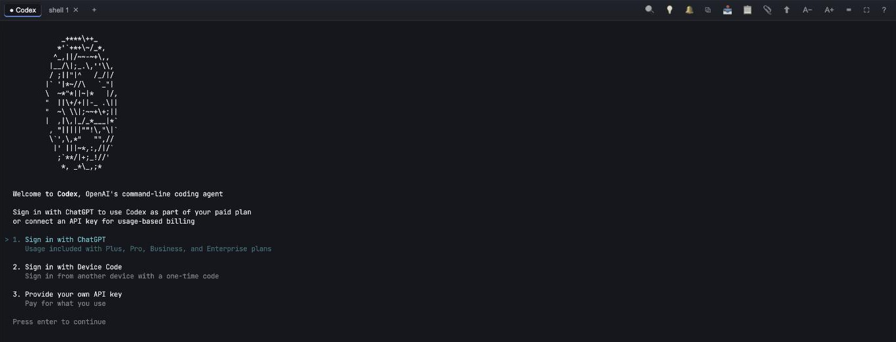

<div align="center">


# Codex — Home Assistant Add-on

OpenAI's [Codex](https://github.com/openai/codex) CLI, running inside Home Assistant as a web
console — and answering from Assist, in text and in voice.

[](https://my.home-assistant.io/redirect/supervisor_add_addon_repository/?repository_url=https%3A%2F%2Fgithub.com%2FLayerTM%2FCodexInHA)

[](codex/CHANGELOG.md)
[](LICENSE)
[](https://www.home-assistant.io/)

[](codex/config.yaml)
[](codex/config.yaml)
&nbsp;
[](https://github.com/LayerTM/CodexInHA/actions/workflows/ci.yml)
[](https://github.com/LayerTM/CodexInHA/commits/main)



</div>

## What you get

- **The real Codex CLI**, not a wrapper — your own sign-in, your own model, skills, plugins, MCP
  servers and the web tools it ships with, all working as they do in a terminal.
- **A console that behaves like one in a browser** — tabs, a clipboard that works even over plain
  HTTP, drag-and-drop attachments, a searchable scrollback, and a touch key bar on phones.
- **Home Assistant, already wired up** — `ha`, `ha-state`, `ha-check`, `hass-cli`, `yq` and a
  bundled skill pack are preinstalled, and Codex works in your configuration directory.
- **Chat from Assist** — a companion integration talks to the add-on over a locked-down prompt API,
  so you can ask about the house by text or voice. Each request runs a fresh, read-only Codex with
  no shell, no web and none of your own configuration, and can touch only the entities you have
  exposed to Assist. An action is proposed first and carried out only after you confirm it.
- **A record of what it changed** — every Home Assistant call a chat request makes is written to an
  audit log where the call passes, with what it asked for and what came back.
- **Alerts without a model** — opt-in, deterministic checks for a leak, a door left open at night,
  a flat battery, CO2, humidity, or a device that dropped off the network.
- **Survives the browser** — the session lives in tmux, so closing the tab never kills Codex.

## Installation

1. Click the badge above, or add this repository under
   **Settings → Add-ons → Add-on Store → ⋮ → Repositories**:
   ```
   https://github.com/LayerTM/CodexInHA
   ```
2. Install **Codex** from the store and start it.
3. Open it with **Open Web UI** on the add-on page. Home Assistant leaves **Show in sidebar** off
   for every add-on it installs — turn it on there if you want a **Codex** entry in the sidebar.

Sign in from the console: run `codex login` and follow the link to use your ChatGPT plan, or set an
**API Key** in the add-on's configuration. See the
[documentation](codex/DOCS.md) for everything else.

## Requirements

- Home Assistant OS or Supervised, on `aarch64` or `amd64`
- A ChatGPT plan that includes Codex, or an OpenAI API key
- For chat from Assist: the companion **AI Agent** integration and the **Model Context Protocol
  Server** integration

## Documentation

The add-on's **Documentation** tab, or [`codex/DOCS.md`](codex/DOCS.md): every option, what the
prompt API refuses and why, the audit log, and the alert rules.

## What is in this repository

| path | what it is |
|---|---|
| `codex/` | the add-on: its Dockerfile, options, engine hooks and the Codex adapter |
| `codex/app/adapter/` | everything the console and the prompt API need to know about Codex |
| `codex/core/` | the pinned `ha-agent-core` release and the verifier that checks it |
| `codex/rootfs/` | the service, the engine hooks and the commands the add-on installs |
| `codex/skills/` | the bundled Home Assistant skill pack |

The console, the prompt server and the background loops are not in this repository: they come from
the [`ha-agent-core`](https://github.com/LayerTM/ha-agent-core) release pinned in
`codex/core/core.lock.json`, whose digest is verified before anything is unpacked into the image.

## Building and testing

The tests run against the tree the image ships — this repository's files merged with the pinned
core:

```sh
.github/scripts/core_archive.sh /tmp/core
codex/core/assemble.sh /tmp/core/core.tar codex /tmp/addon
cd /tmp/addon/app && "/tmp/addon/install-tools/npm-ci-checked.sh" && npm test
```

The add-on's own tests need none of that and run straight from a checkout, with no dependencies to
install:

```sh
cd codex/app && node --test test/*.test.js
```

The tests in `codex/app/test/assembled/` are the exception, and say so by where they live: they read
a module that arrives with the core, so they run with the command above this one.

`npm run lint` and `npm run typecheck` do need the assembled tree: eslint and typescript arrive with
the core, not with this repository.

## Licence

[MIT](LICENSE) © 2026 LayerTM

Codex and ChatGPT are products of OpenAI. This is an independent, community-maintained add-on, and
is not affiliated with or endorsed by OpenAI or the Home Assistant project.
